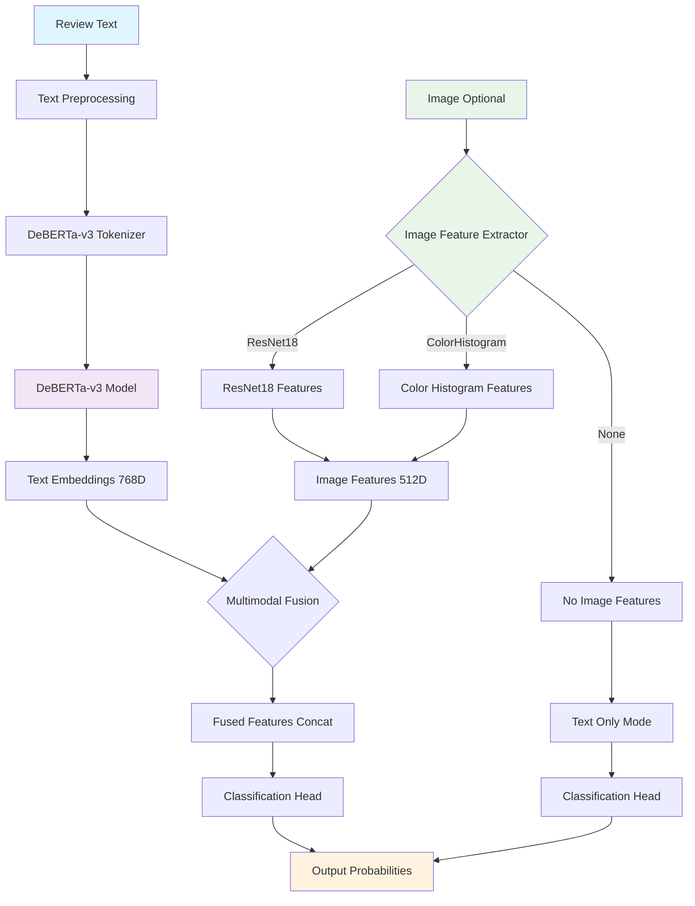

# 🕵️ Truthful vs Deceptive Review Classifier

This project is a **Streamlit web app** for classifying customer reviews as either **truthful** or **deceptive**, with optional **image features**. It uses **DeBERTa-v3** (Microsoft's Transformer model) for text and optionally fuses **ResNet18/ColorHistogram** features for images.

## ✨ Features

- Fine-tunes **`microsoft/deberta-v3-base`** for binary classification (`truthful` / `deceptive`)
- **Optional multimodal setup**:
  - Use review text only
  - Or fuse text + image features (ResNet18 / ColorHistogram)
- **Real-time training progress**:
  - Epoch bar + batch bar
  - Live updates of training loss & validation F1
- **Evaluation metrics**:
  - Precision, Recall, F1, Accuracy (on validation split)
- **Model saving & reloading**:
  - Saves weights + tokenizer + image config to `saved_model/`
  - Can restart Streamlit and still do inference
- **Quick inference**:
  - Enter review text
  - Optionally upload an image
  - Get prediction + probabilities instantly

## 📦 Requirements

See [`requirements.txt`](requirements.txt):

```txt
streamlit>=1.36
pandas>=2.2
numpy>=1.26
scikit-learn>=1.4
torch>=2.2
torchvision>=0.17
transformers>=4.42
datasets>=2.20
Pillow>=10.3
```

Install with:

```bash
pip install -r requirements.txt
```

## 🚀 How to Run

1. Clone this repo and install requirements
2. Start Streamlit:

```bash
streamlit run streamlit_app.py
```

3. Open the app in your browser (default: [http://localhost:8501](http://localhost:8501))

## 📂 Data Format

Upload a CSV with at least these columns:

- **`text`** → review text
- **`label`** → must be either `truthful` or `deceptive`
- **`photo`** *(optional)* → relative/absolute path to image files

Example:

| text                               | label     | photo            |
|------------------------------------|-----------|------------------|
| "The food was amazing!"            | truthful  | imgs/review1.jpg |
| "Best restaurant in town! 50% OFF" | deceptive | imgs/promo.png   |

## 🛠️ Training

- Select your CSV in the sidebar
- Configure:
  - Text column, label column, photo column
  - Training parameters (epochs, batch size, learning rate)
  - Image features (None, ResNet18, or ColorHistogram)
- Click **Train Model**
  - You'll see live progress + metrics
  - Model saved to `saved_model/`

## 🔮 Inference

Two modes:

### 1. Quick Inference (UI)
- Enter review text
- Optionally upload an image
- Get label + probabilities

### 2. Batch inference (future extension)
- Upload a CSV
- Download predictions CSV

## ⚡ Notes

- **Preprocessing**: text is lightly cleaned (URLs → `<URL>`, emails → `<EMAIL>`, numbers → `<NUM>`)
- **Train/test split**: stratified (keeps class balance), 80% training / 20% validation
- **Device**: uses GPU if available, otherwise CPU
- **Model size**:
  - Default = `deberta-v3-base`
  - Can switch to smaller (e.g., `deberta-v3-small`) for faster training

## 📊 Example Metrics Output

```json
{
  "truthful": {
    "precision": 0.87,
    "recall": 0.80,
    "f1-score": 0.83,
    "support": 15
  },
  "deceptive": {
    "precision": 0.82,
    "recall": 0.89,
    "f1-score": 0.85,
    "support": 15
  },
  "accuracy": 0.84,
  "macro avg": {
    "precision": 0.85,
    "recall": 0.85,
    "f1-score": 0.84,
    "support": 30
  },
  "weighted avg": {
    "precision": 0.85,
    "recall": 0.84,
    "f1-score": 0.84,
    "support": 30
  }
}
```

## 🏗️ Model Architecture



### Architecture Details

**Text Processing Pipeline:**
- Input text → Preprocessing (clean URLs, emails, numbers)
- DeBERTa-v3 tokenization → Transformer encoding
- Output: 768-dimensional text embeddings

**Image Processing Pipeline (Optional):**
- **ResNet18**: Pre-trained CNN features (512 dimensions)
- **ColorHistogram**: RGB histogram features (768 dimensions)
- **None**: Text-only classification

**Fusion Strategy:**
- **Multimodal**: Concatenate text + image features → Classification head
- **Text-only**: Direct text features → Classification head

## 📌 To Do / Extensions

- Batch inference (upload CSV → download predictions)
- Option to choose model (`deberta-v3-small`, `base`, `large`)
- Experiment with augmentation (synonyms, back-translation)
- Support for multilingual reviews
